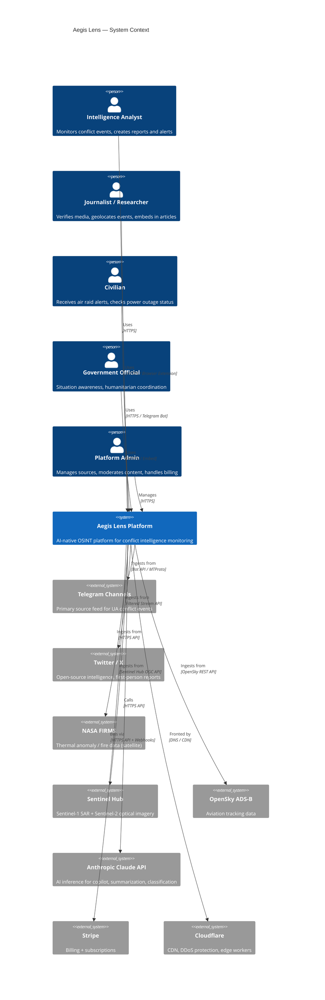
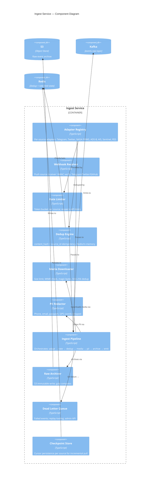

# C4 Architecture Diagrams — Aegis Lens

Diagrams use Mermaid (C4 context + container levels).
Render at https://mermaid.live or in any C4-compatible tool.

## Level 1 — System Context

## Level 2 — Container Diagram

```mermaid
C4Container
    title Aegis Lens — Container Diagram

    Person(user, "User (Any Persona)")

    Container(web_app, "Web Application", "Next.js 15 / App Router", "Main user interface: map, dashboards, reports, settings")
    Container(ext, "Browser Extension", "MV3 / Chrome+Firefox", "OSINT capture, source badge, coordinate detection")
    Container(api, "API Gateway", "Next.js API Routes", "Auth (JWT/API key), rate limiting, quota, tracing")

    ContainerDb(postgres, "PostgreSQL + PostGIS + TimescaleDB", "Database", "Events (hypertable), orgs, users, alerts, cases, notebooks, audit log")
    ContainerDb(qdrant, "Qdrant", "Vector DB", "Event embeddings for semantic search + RAG")
    ContainerDb(elastic, "Elasticsearch", "Search Engine", "Full-text search with locale-aware analyzers")
    ContainerDb(redis, "Redis", "Cache", "Rate limit counters, hot key cache, session store")
    ContainerDb(s3, "S3", "Object Store", "Raw archive, media, Parquet cold archive, tile cache")

    Container(kafka, "Apache Kafka", "Message Broker", "events.raw → events.enriched → events.verified pipeline")
    Container(ingest, "Ingest Service", "TypeScript", "Source adapters, dedup, normalise, PII redact, archive")
    Container(nlp, "NLP Service", "TypeScript", "Lang detect, translation, NER, classify, sentiment, embed")
    Container(geo_svc, "Geo Service", "TypeScript", "Geocoding, reverse-geocoding, coord parsing, AOI lookup")
    Container(anomaly_svc, "Anomaly Service", "TypeScript", "Z-score, EWMA, DBSCAN, source burst, alert generation")
    Container(search_svc, "Search Service", "TypeScript", "Hybrid BM25+dense+geo, spell correction, facets")
    Container(alerts_svc, "Alert Service", "TypeScript", "Rule matching, fan-out, retry/DLQ, throttle")
    Container(reports_svc, "Reports Service", "TypeScript", "LLM generation, PDF rendering, versioning")
    Container(tile_svc, "Tile Service", "TypeScript", "MVT generation, CDN integration, snapshots")
    Container(tg_bot, "Telegram Bot", "TypeScript", "Civilian alerts, daily briefs, command interface")

    Rel(user, web_app, "Uses", "HTTPS")
    Rel(user, ext, "Uses", "Browser")
    Rel(web_app, api, "Calls", "HTTP")
    Rel(ext, api, "Calls", "HTTPS")
    Rel(api, postgres, "Reads/Writes", "pgbouncer → TCP")
    Rel(api, qdrant, "Queries", "HTTP")
    Rel(api, elastic, "Queries", "HTTP")
    Rel(api, redis, "Caches", "TCP")
    Rel(ingest, kafka, "Publishes to", "TCP")
    Rel(kafka, nlp, "Consumed by", "TCP")
    Rel(kafka, geo_svc, "Consumed by", "TCP")
    Rel(kafka, anomaly_svc, "Consumed by", "TCP")
    Rel(nlp, postgres, "Writes", "TCP")
    Rel(nlp, qdrant, "Writes vectors", "HTTP")
    Rel(alerts_svc, kafka, "Consumes", "TCP")
    Rel(alerts_svc, tg_bot, "Triggers", "HTTP")
    Rel(ingest, s3, "Archives to", "HTTPS")
    Rel(tile_svc, s3, "Caches to", "HTTPS")
    Rel(reports_svc, postgres, "Reads events", "TCP")
```

## Level 3 — Ingest Service Components

