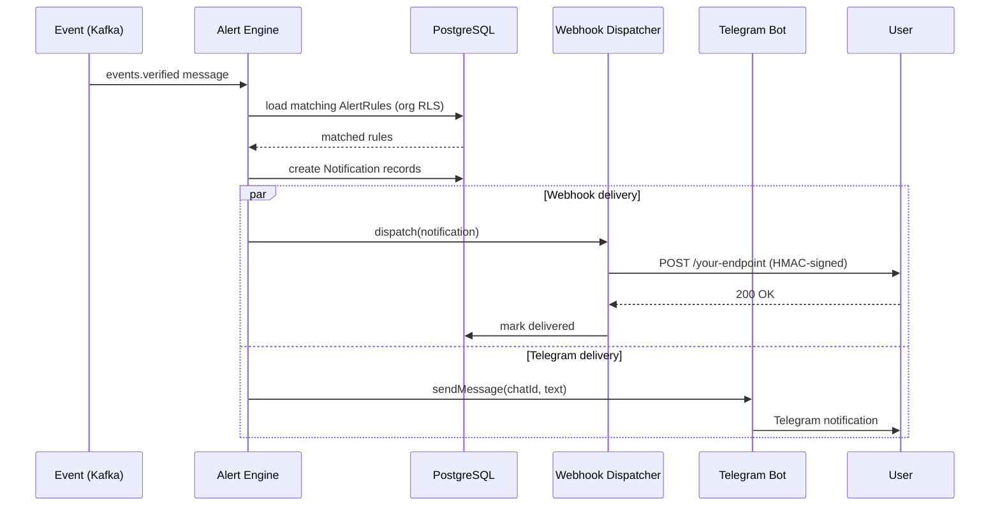
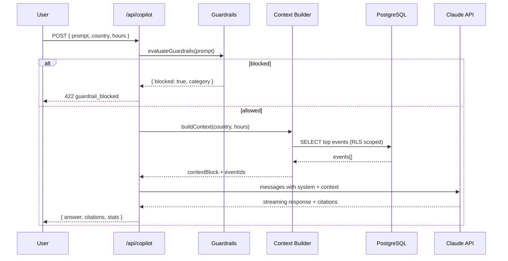
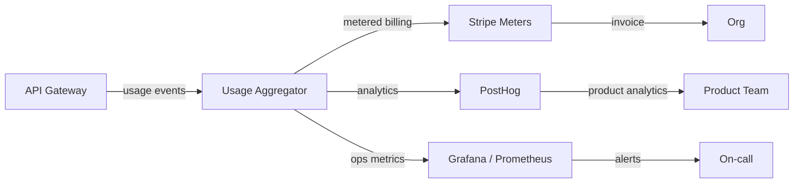

# Data Flow Diagrams — Aegis Lens

All major data paths from external source to user-facing surfaces.

## 1. Ingest → Enrich → Serve

```mermaid
flowchart TD
    subgraph Sources["External Sources"]
        TG[Telegram Channels]
        TW[Twitter / X]
        ADS[ADS-B Aviation]
        FIRMS[NASA FIRMS]
        SH[Sentinel Hub]
        NB[NetBlocks]
        PO[Power Outage Signals]
        CR[Community Reports]
    end

    subgraph Ingest["Ingest Layer"]
        RA[Raw Archive\nS3 / object store]
        NRM[Normaliser\n@ua-map/ingest]
        KF1[Kafka: events.raw]
    end

    subgraph Enrich["Enrichment Pipeline"]
        NLP[NLP Service\nlang detect · NER · classify · embed]
        VIS[Vision Service\nOCR · deepfake · sun-angle]
        GEO[Geo Service\ngeocoding · PostGIS]
        TAG[Auto-Tagger\nhierarchical taxonomy]
        ENT[Entity Extractor\nKG linking]
        KF2[Kafka: events.enriched]
    end

    subgraph Verify["Verification"]
        COR[Corroboration Scorer\nmulti-source confidence]
        ANOM[Anomaly Detector\nZ-score · DBSCAN]
        KF3[Kafka: events.verified]
    end

    subgraph Index["Index Layer"]
        PG[(PostgreSQL\nPostGIS + TimescaleDB)]
        QD[(Qdrant\nvector index)]
        ES[(Elasticsearch\nlexical FTS)]
    end

    subgraph Serve["Serving Layer"]
        API[API Gateway\nNext.js App Router]
        TILE[Tile Service\nMartin / pg_tileserv]
        SSE[SSE Stream\n/api/events/stream]
    end

    subgraph Realtime["Real-time Fanout"]
        ALERT[Alert Engine]
        AOI[AOI Monitor]
        WH[Webhook Dispatcher]
        BOT[Telegram Bot]
        SLACK[Slack Bot]
    end

    subgraph Surfaces["User Surfaces"]
        WEB[Web App\nNext.js]
        SDK[SDK\nTS · Python]
        EMB[Embeds / iFrame]
        EXT[Browser Extension]
    end

    Sources --> RA
    RA --> NRM
    NRM --> KF1
    KF1 --> NLP & VIS & GEO & TAG & ENT
    NLP & VIS & GEO & TAG & ENT --> KF2
    KF2 --> COR & ANOM
    COR & ANOM --> KF3
    KF3 --> PG & QD & ES
    PG --> API & TILE
    QD & ES --> API
    API --> SSE
    KF3 --> ALERT --> WH & BOT & SLACK
    KF3 --> AOI --> WH
    API & TILE & SSE --> WEB & SDK & EMB & EXT
```

## 2. Realtime Alert Delivery



## 3. AI Copilot Query Flow



## 4. Analytics & Billing


