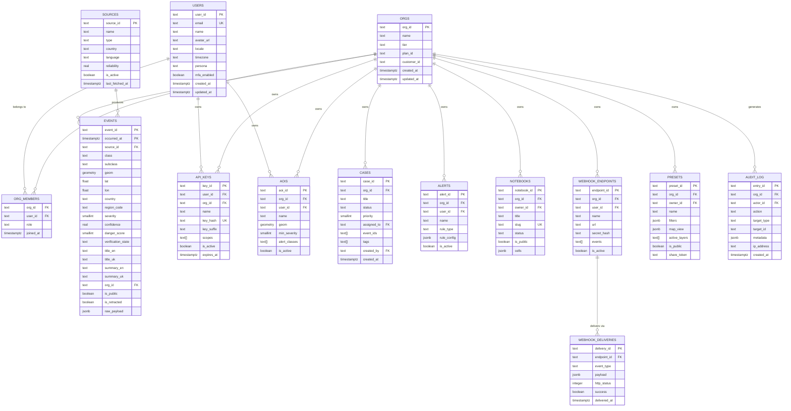
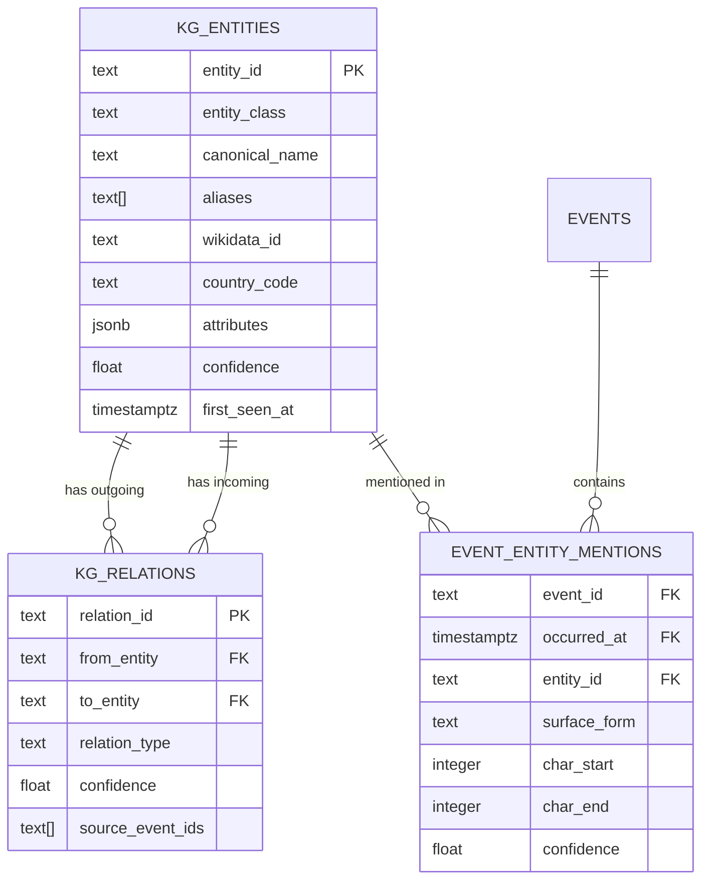

# Entity Relationship Diagram — Aegis Lens

Diagrams as code (Mermaid). Render at https://mermaid.live or in any Mermaid-compatible viewer.

## Core Platform ERD

## Knowledge Graph Extension (Phase 2)

