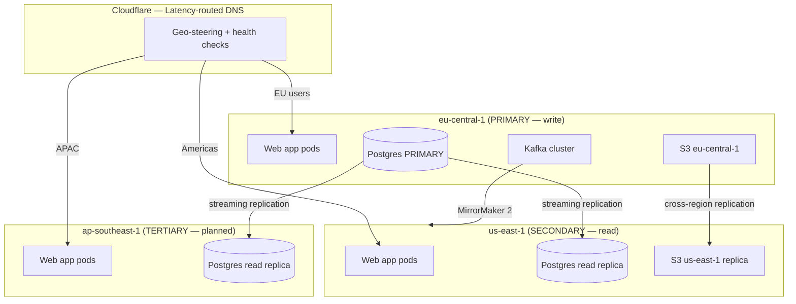

# Multi-Region Architecture — Aegis Lens

Latency-aware routing for global users; resilience to single-region failure.

## Region Topology

## Write vs Read Routing

| Operation | Routed to | Consistency |
|-----------|-----------|-------------|
| Event writes (ingest) | eu-central-1 PRIMARY only | Strong |
| User mutations (create alert, AOI) | eu-central-1 PRIMARY | Strong |
| Event reads (map, search) | Nearest region read replica | Eventual (~1-5s lag) |
| Analytics queries | Nearest region read replica | Eventual |
| Auth (login) | eu-central-1 PRIMARY | Strong |

Application code routes writes to PRIMARY via a separate connection pool (`DATABASE_URL_PRIMARY`) and reads to the regional replica (`DATABASE_URL_REPLICA`).

## EU Data Residency Compliance

EU customers' data **must** stay in eu-central-1:

- `orgs.data_residency = 'eu'` flag enforced at the query layer
- EU-resident orgs' events are **never** replicated to us-east-1 / ap-southeast-1
- Achieved via per-row replication filtering (logical replication publication excludes `data_residency='eu'` rows from cross-region replicas)
- Read requests for EU orgs are always routed back to eu-central-1 regardless of user location

## Failover

| Failure | Detection | Response |
|---------|-----------|----------|
| Region degraded (high latency) | Cloudflare health check fails | DNS steers traffic away from region |
| PRIMARY DB down | RDS Multi-AZ automatic failover | Standby promoted within ~60s (same region) |
| Entire eu-central-1 outage | Manual decision | Promote us-east-1 replica to PRIMARY (RPO ~5s, RTO ~30min) |

### Failover Drill (quarterly)

1. Announce drill in `#ops` (non-production region first)
2. Simulate region loss (block region in Cloudflare)
3. Verify traffic re-routes; measure actual RTO
4. For DB promotion drills: use staging, never production
5. Document actual RTO/RPO vs targets; file action items for gaps

## Phased Rollout

- **Phase 1 (now):** Single write region (eu-central-1) + Multi-AZ. Read replica in-region.
- **Phase 2:** Add us-east-1 read replica + latency-routed DNS for reads.
- **Phase 3:** Active-active write path (significant investment — only if measured need). Options: Citus distributed, or CRDT for hot counters + conflict-free merge.

## Observability per Region

Each region runs its own Prometheus + Grafana Agent, federated to a central Grafana. Alerts fire on per-region SLO breaches independently.
