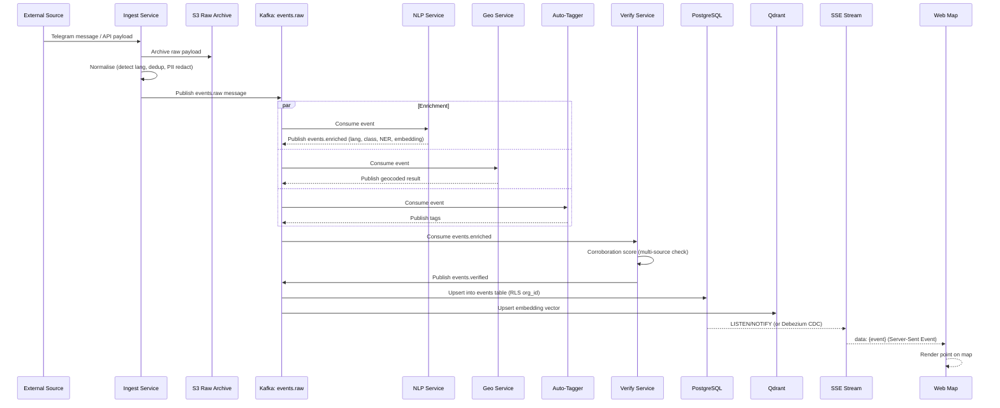
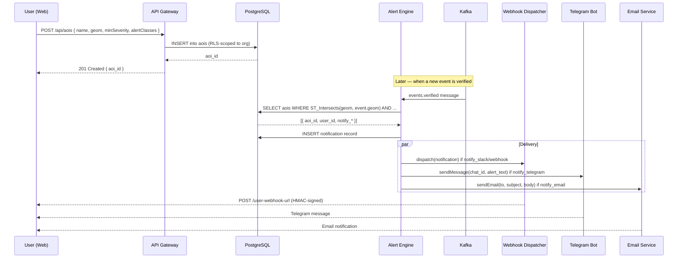
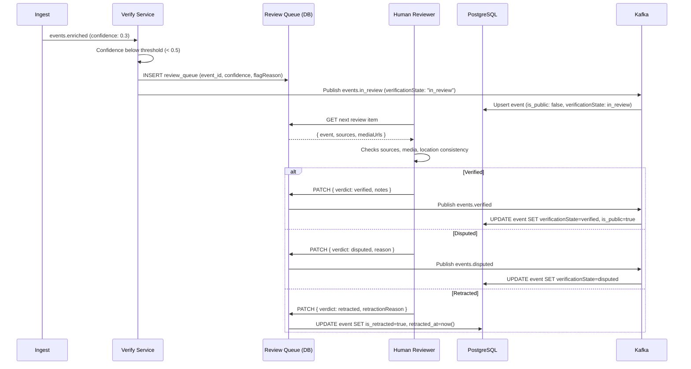
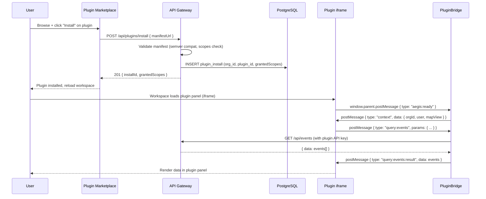
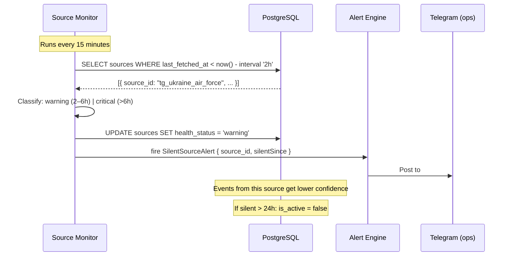

# Sequence Diagrams — Aegis Lens

Key cross-service sequences for onboarding and debugging.

## 1. Event Ingest → Published on Map

## 2. User Creates AOI → First Alert Delivered

## 3. Verification: Low-Confidence Event → Review Queue → Publish

## 4. Plugin Install → First Data Render

## 5. Source Goes Silent → Degrade + Alert

