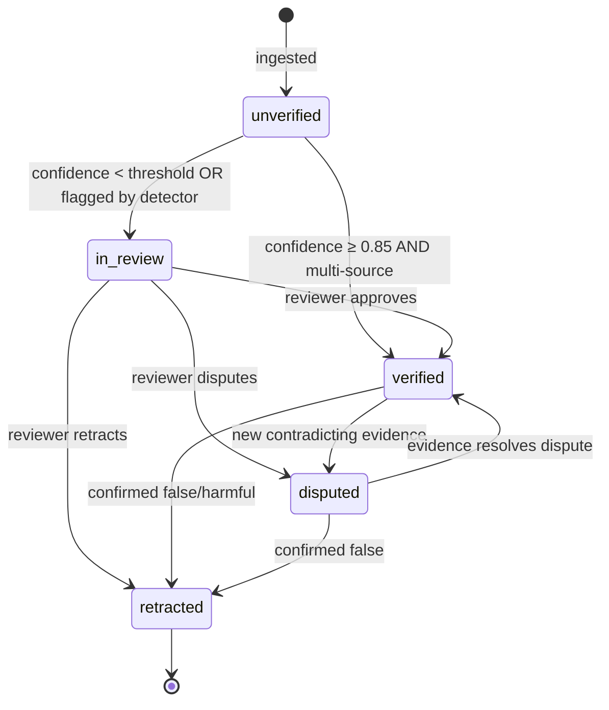
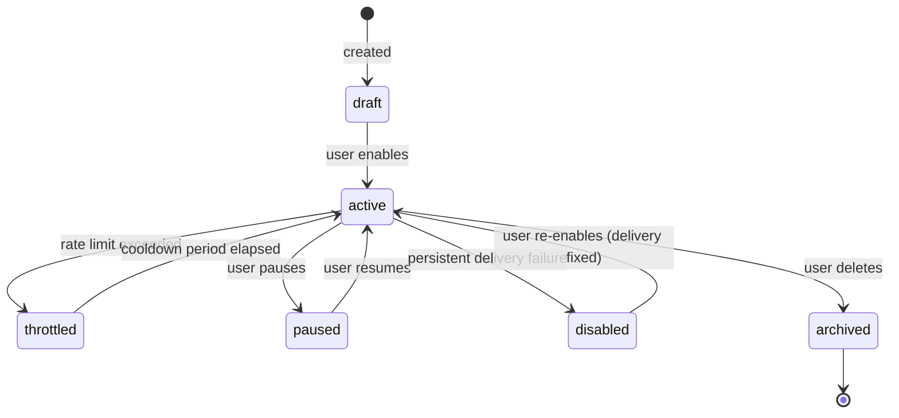
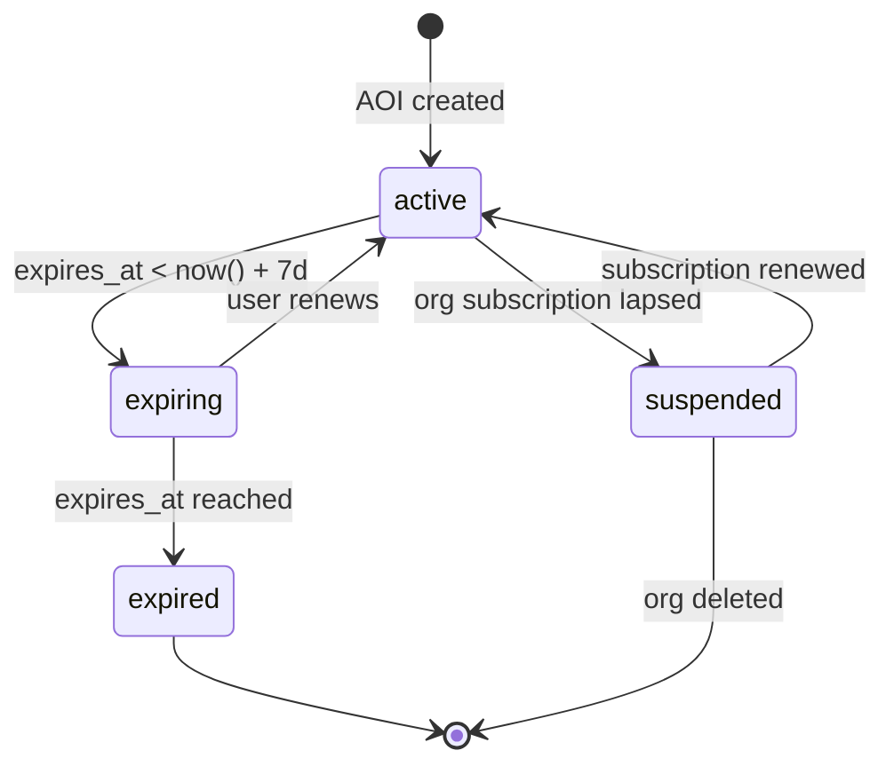
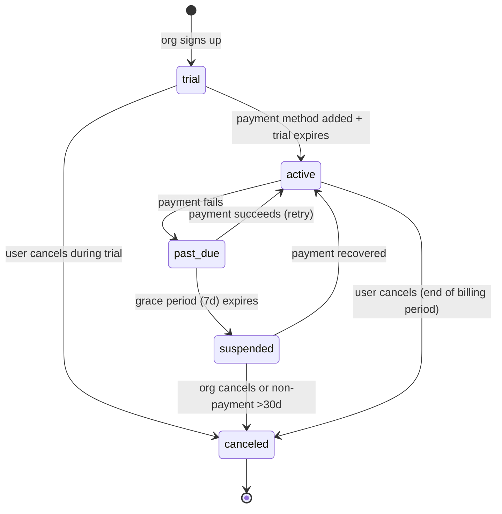
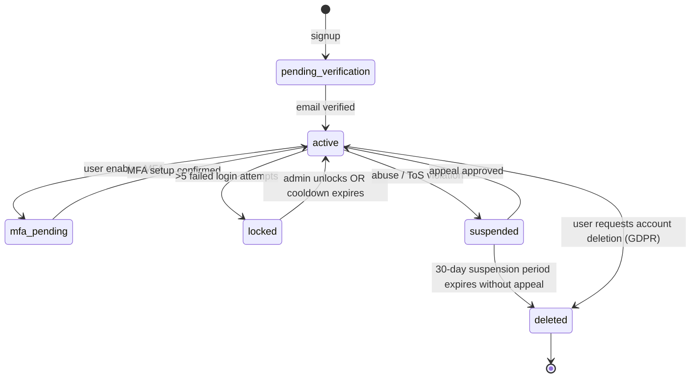
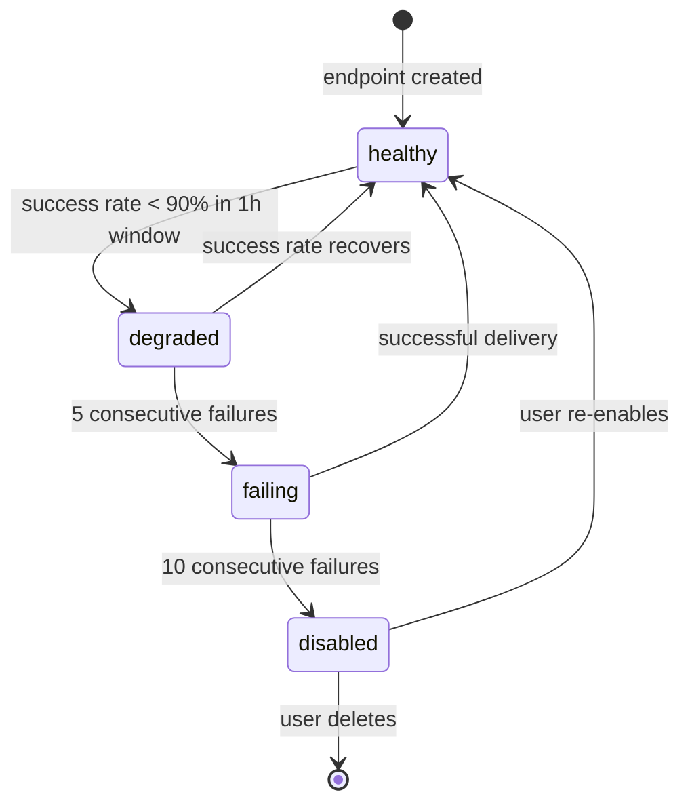

# State Machines — Aegis Lens

Diagrams use Mermaid stateDiagram-v2. Valid transitions documented per machine.

## 1. Event Verification State

Guards:
- `unverified → verified` requires `confidence ≥ 0.85` AND `sourceCount ≥ 2`
- `in_review → verified` requires at least one human reviewer approval
- `retracted` is terminal — no unretraction possible (create new event instead)

## 2. Alert Rule Lifecycle

## 3. AOI Subscription

## 4. Billing / Subscription

## 5. User Account Lifecycle

## 6. Webhook Endpoint Health

